# Short Tutorial for RTL Kernel example.

This tutorial explains the procedure to run SDAccel flow using a RTL Kernel description. The tutorial is using **vadd_kernel** example from the SDAccel Github examples repository.  

Following steps are needed in order to run SDAccel using RTL Kernel.  
1. Prepare the RTL adhering the interface requirement. 
   - A XML file needs to be created describing the RTL interface.    
2. Generate XO (Xilinx Object) file for RTL Kernel.  
3. Run SDAccel with OpenCL Host code and XO file.

**RTL Kernel Wizard** is a useful flow to create the required RTL Interface that can be used by the user as a starting point. Based on the user input, RTL Kernel Wizard creates the top-level RTL module adhering the interface requirement. The user then can drop his own RTL inside the top-level interface module. RTL Kernel Wizard also creates the necessary XML file and finally creates XO (Xilinx Object) file, required for SDAccel flow. **In other words, the first two steps listed above can be automated by using RTL Kernel Wizard flow**.   

To know more details about RTL Kernel wizard flow, you may look at this online [quick-take video](https://www.youtube.com/watch?v=IZQ1A2lPXZk)


**Description of the tutorial testcase:**    

This tutorial, however, is not demonstrating RTL Kernel Wizard flow as the RTL and XML file already exist for this VAdd example.  

Execute the following commands to clone the Github repository and configure the SDAccel environment:   

```
    $ git clone https://github.com/aws/aws-fpga.git
    $ cd aws-fpga                                      
    $ source sdaccel_setup.sh
```   

Go the testcase directory   

```
   cd SDAccel/examples/xilinx/getting_started/rtl_kernel/rtl_vadd
```


## Step 1: Prepare the RTL adhering the interface requirement  
To use the RTL in SDAccel flow, RTL designer must adhere specific interface coding requirement. Strictly speaking, the RTL interface only requires AXI master and slave interface in order to transfer data to and from the host.  

For a detailed description, please refer [Interface requirement](https://www.xilinx.com/html_docs/xilinx2017_1/sdaccel_doc/topics/design-flows/reference-rtl-kernel-interface-req.html) section in SDAccel User Guide.  

The RTL for this example can be found inside **src/hdl** directory. 

## Step 2: Generating XO file for RTL Kernel  

By using RTL Kernel Wizard we can generate XO file automatically. However, as this example has already prepared RTL and XML file, we will create XO file manually using the **package_xo** command. 

To use the **package_xo** command manually, we need a couple of prerequisites.  

1. Packaged IP: The VAdd example uses one script (./scripts/package_kernel.tcl) that packages the existing RTL design to IP and import to a directory named  “./packaged_kernel_${suffix}”  (“suffix” is specified as an user argument).    

2. A Kernel description XML file: The XML file for this example is already prepared and placed at src/kernel.xml  

Here are the basic switches of the **package_xo** command used in this example:     

|  Switches         |  Type      |  Description                  |
|:-----------------:|:----------:|:-----------------------------:|
| **xo_path**	    |   Output	 | Output XO file path and name  |  
| **kernel_name**   |   Input	 | Name from the TOP level RTL   |  
| **ip_directory**  |	Input	 | Name of the RTL-IP directory  |  
| **kernel_xml**    |	Input	 | Kernel description XML file   |  

Vivado command execution to create XO file   

```
>> vivado -mode tcl  
# Set suffix for the directory for RTL-IP import   
Vivado% set suffix rtl_ip    
# RTL-IP will be imported to the directory “packaged_kernel_{$suffix}”   
Vivado% source scripts/package_kernel.tcl   
Vivado% package_xo -xo_path ./src/rtl_vadd.xo -kernel_name krnl_vadd_rtl -ip_directory ./packaged_kernel_rtl_ip -kernel_xml ./src/kernel.xml
Vivado% exit
```

Generated XO file: **./src/rtl_vadd.xo**


## Step 3: Running SDAccel with Host code, XO file  

The Host code for this example is **./src/host.cpp** file.  

Note, for SDAccel, the host code must use OpenCL programming paradigm. 

The SDAccel Github examples use common header files and those needs to be copied in the local project source folder to make it easier to use. Type the command **make local-files** to copy all necessary files in the local directory.  

```
  make local-files
```

We will now launch SDAccel in GUI mode and import Host code (**host.cpp**) and XO file (**rtl_vadd.xo**).  

Open the SDx GUI by running the following command in the terminal:

```
>> sdx 
``` 

After invoking the GUI, we will follow the following steps, broadly categorized as:  
  - GUI Setup Steps  
  - Verification Step  
  - Execution Steps  


**GUI Setup Steps**  
&nbsp;&nbsp;&nbsp;A. Set a Workspace  
&nbsp;&nbsp;&nbsp;B. Set the Platform  
&nbsp;&nbsp;&nbsp;C. Create a Project  
&nbsp;&nbsp;&nbsp;D. Import Host code and Kernel XO file  
&nbsp;&nbsp;&nbsp;E. Specify Binary container for Kernel executable.   
**Verification Step**  
&nbsp;&nbsp;&nbsp;F. Verify the Application by Hardware Emulation flow  
**Execution Steps**   
&nbsp;&nbsp;&nbsp;G. Compile the Application for FPGA execution  
&nbsp;&nbsp;&nbsp;H. Execute the Application on AWS F1 instance  


### A. Set a Workspace

Add workspace inside the current directory named **Test_dir** as shown below. A new directory **Test_dir** will be created and used to store all logfiles of our runs.

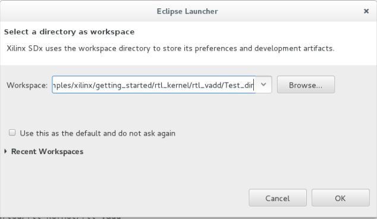

### B. Set the Platform

You will get a Welcome screen. You need to set Platform path by selecting **Add custom platform** as shown below.

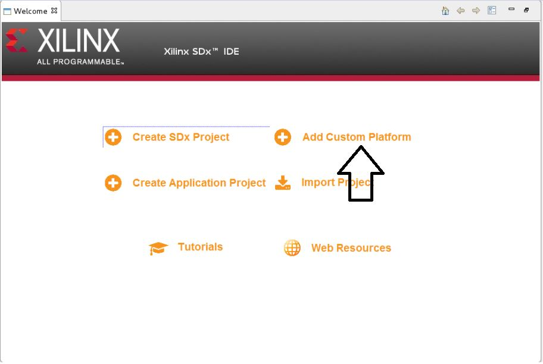

Click on the plus sign as shown below.

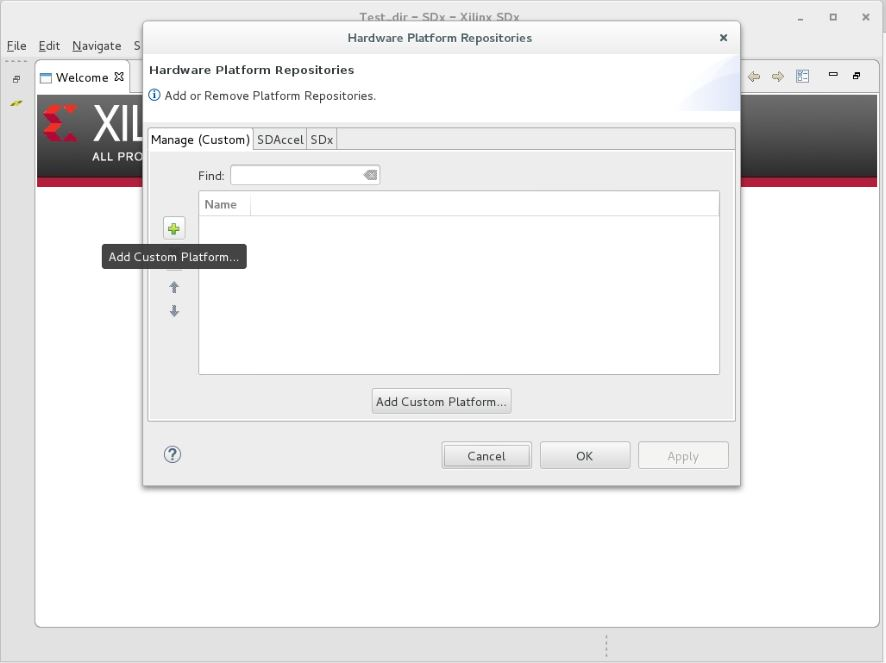

Then browse to the <git area>/SDAccel/aws_platform/xilinx_aws-vu9p-f1_4ddr-xpr-2pr_4_0/ directory, select platform.    

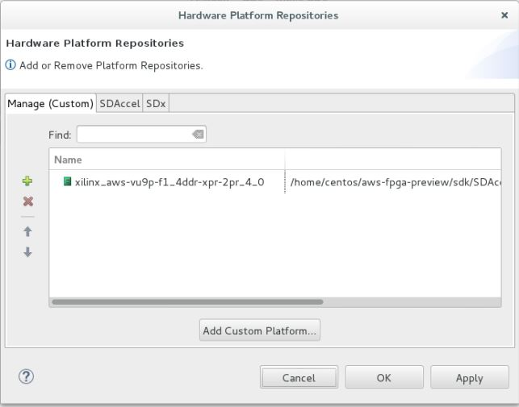

Click **Apply** and **OK**. This completes the Platform setup process. 

### C. Create a Project

Now you are back to Welcome screen.

Select **Create SDX Project**, give a project name **TEST_RTL_KERNEL**.  
Move through the next couple screens (keeping default selection) by clicking **Next** -> **Next** -> **Next**.  
Finally Select an **Empty Application** in the **Available Templates** section, and then click **Finish**.

### D. Import Host code and Kernel XO file. 

Now with the SDX GUI open, at the left side you can see **Project Explorer** window. Right Click on **project.sdx** and then Select **Import**.

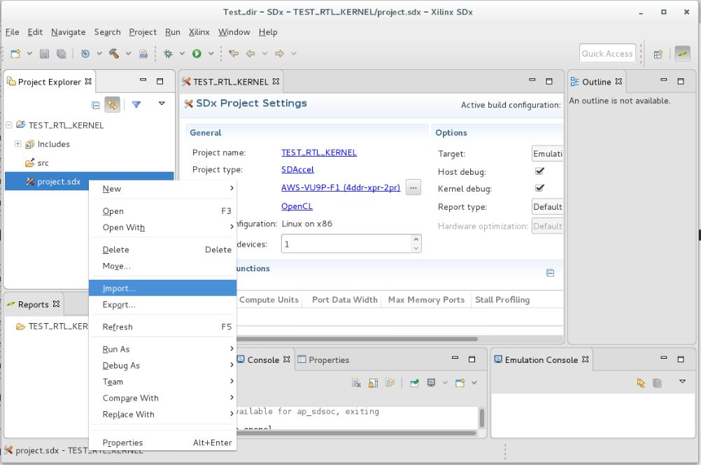

Select **General** -> **Filesystem** and then click on **Next**.  

Browse to the source file directory of the current example, **rtl_vadd/src**

Select the files **host.cpp** , **xcl.c**, **xcl.h** and **rtl_vadd.xo** as shown below.

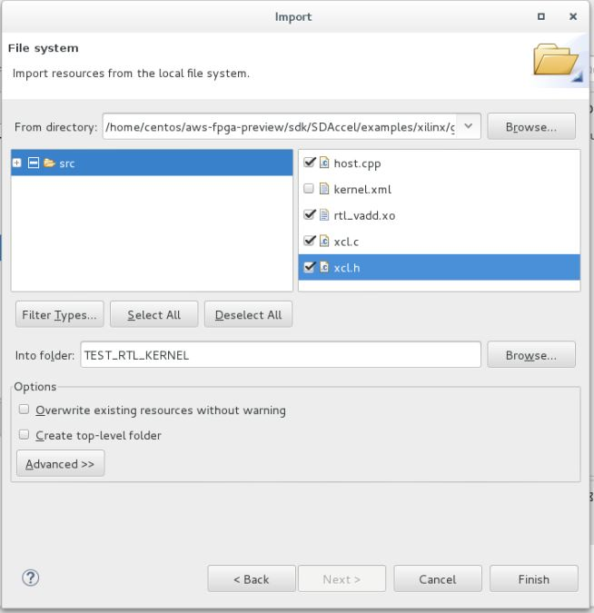

### E. Specify Binary Container for Kernel executable

Follow the steps below to add Binary Container  

Click **Add Binary Container** icon as shown below 

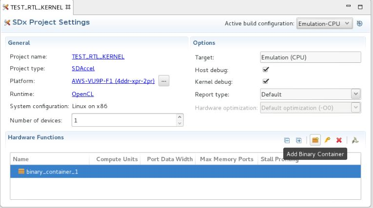

Select **Automatically add binary container(s) to arguments** from the top Menu **Run**->**Run Configuration**-> Selecting **Arguments** tab (as shown below)


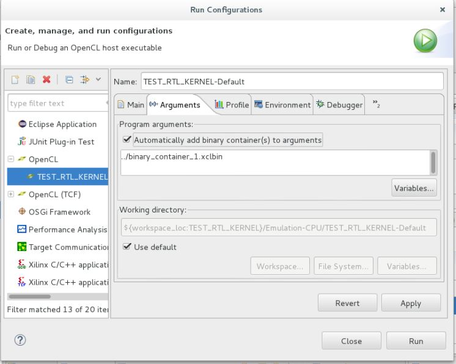

We completed the GUI setup, now we will verify our Application by Hardware Emulation flow. 
		   
### F. Verify the Application by Hardware Emulation flow 


Set **Active Build Configuration** to **Emulation-HW** inside **SDx Project Settings**.   

Other selection choices of **Active Build Configuration** are **Emulation-CPU** and **System**. **Emulation-CPU** performs Software Emulation build that is only applicable to the C,C++ and OpenCL Kernels. In other words, with RTL Kernel, Hardware Emulation is only applicable. **System** Performs Hardware build process that we will cover in next step G.  


 
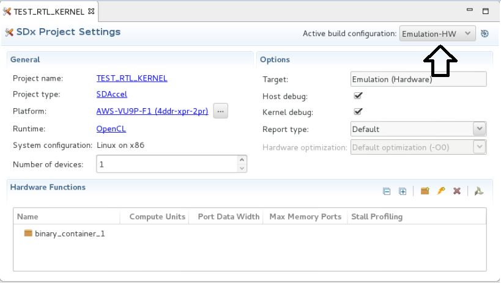

Then click on the **Build** icon to start Emulation build process.
 
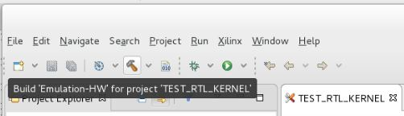   

After Emulation build process completes, run Hardware Emulation flow by clicking on the **Run** Icon. 

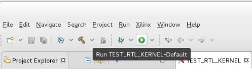

After the completion of Hardware Emulation run, in the **Reports** tab, you can inspect various reports, such as **System Estimate**, **Profile Summary**, and  **Application Timeline**.  

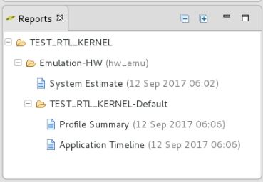 

### G. Compile the Application for FPGA execution   

Select **System** from the **Active build configuration** from the **SDx Project Settings** window. Click on the **Build** icon to initiate the hardware build process. It generally takes few hours to complete the hardware build.   
 
At the end of this process, you get Host executable and Kernel executable inside the **System** directory.  

**Host executable**: TEST_RTL_KERNEL.exe      
**Kernel executable**: binary_container_1.xclbin     

These executables are now ready to execute on AWS F1 instance. 

### H. Execute the Application on the AWS F1 instance   

At present, you cannot execute the application on the F1 instance through GUI. We need to follow AWS specific procedure to create AFI from the generated XCLBIN. So exit from the GUI and follow the steps on a terminal.   

- Create an AWS FPGA binary file with an AWSXCLBIN extension  

Use the script **create_sdaccel_afi.sh** to convert the .xclbin file (specified by –xclbin switch) to .awsxclbin file (specified by –o switch) as shown below. You also need to provide the location of S3 bucket, dcp-folder and log-folder.   

```
$SDACCEL_DIR/tools/create_sdaccel_afi.sh \
        -xclbin=binary_container.xclbin \
         -o=<output_awsxclbin_filename> \
	       -s3_bucket=<bucket-name> \
          -s3_dcp_key=<dcp-folder-name> \
	     -s3_log <logs-folder-name>
```  

The above step will generate <>.awsxclbin file (specified by -o switch). You will also get an AFI (Amazon FPGA Image) ID file containing AFI ID of the process. The AFI ID can be used to check the completion of the AFI generation process.  

- Rename the .awsxclbin to original .xclbin file.  

```
mv <generated>.awsxclbin binary_container.xclbin
```  
    
- Check Status of AFI generation process by using AFI-ID  

```
cat <timestamp>_afi_id.txt # Note the AFI-ID from this command 
```  

Execute the command below to check the status of AFI generation process. 

```
#Checking the status   
aws ec2 describe-fpga-images --fpga-image-ids <AFI ID> 
```
	
A finished AFI creation job will show **Available** State. Otherwise, it shows **Pending**.   

```
	"State: { 
		   "Code" : Available" 
		}
```
		
- Once **Available** execute the application on the F1 instance  

```
$ sudo sh
# source /opt/Xilinx/SDx/2017.1.rte/setup.sh   
# ./TEST_RTL_KERNEL.exe 
Device/Slot[0] (/dev/xdma0, 0:0:1d.0)
xclProbe found 1 FPGA slots with XDMA driver running
INFO: Importing ./binary_container.xclbin
INFO: Loaded file
INFO: Created Binary
INFO: Built Program
All Device results match CPU results! 
TEST PASSED.
```	

